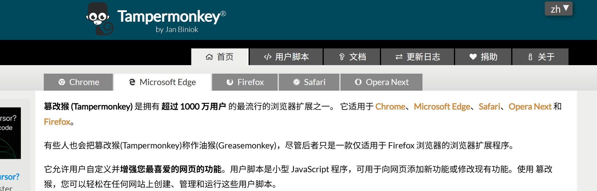
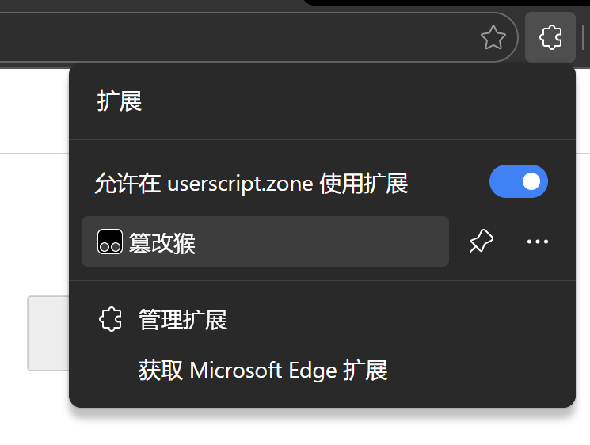
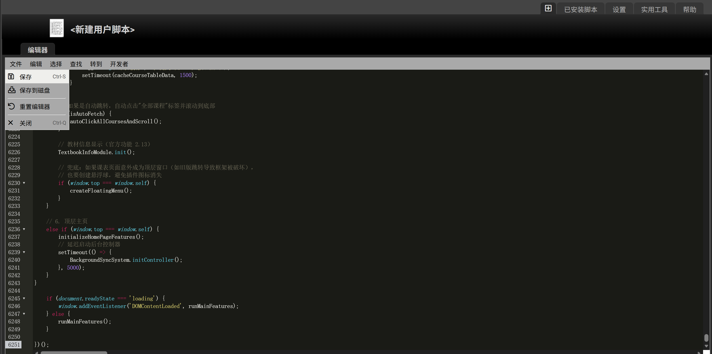

# 翱翔教务功能加强

基于 [翱翔教务功能加强](https://greasyfork.org/zh-CN/scripts/524099-%E7%BF%B1%E7%BF%94%E6%95%99%E5%8A%A1%E5%8A%9F%E8%83%BD%E5%8A%A0%E5%BC%BA) 油猴脚本二次开发，**非原作者**。

## 新增功能

- **GPA 预测**：为未出分课程设定预估绩点，计算预测总 GPA

## 使用方法

### 第一步：安装油猴插件

根据浏览器选择对应的版本进行安装，详见 [Tampermonkey](https://www.tampermonkey.net/)。



### 第二步：打开油猴插件

点击浏览器右上角的油猴插件图标。



### 第三步：添加新脚本

在菜单中点击「添加新脚本」。


### 第四步：粘贴脚本代码

删除默认内容，打开本项目的 `main.user.js` 文件，复制全部代码粘贴进去，然后点击「保存」。



### 第五步：开始使用

安装成功，登录翱翔教务系统即可使用。


## 开发者

```bash
# 安装依赖
npm install

# 运行测试
npm test
```

## 目录结构

```
nwpu-edu-plus/
├── main.user.js      # 主脚本
├── package.json      # 项目配置
├── tests/           # 测试
└── README.md
```

## 分支说明

- `main` 分支：开发分支，包含自定义功能
- `official` 分支：同步官方代码，会定期更新
